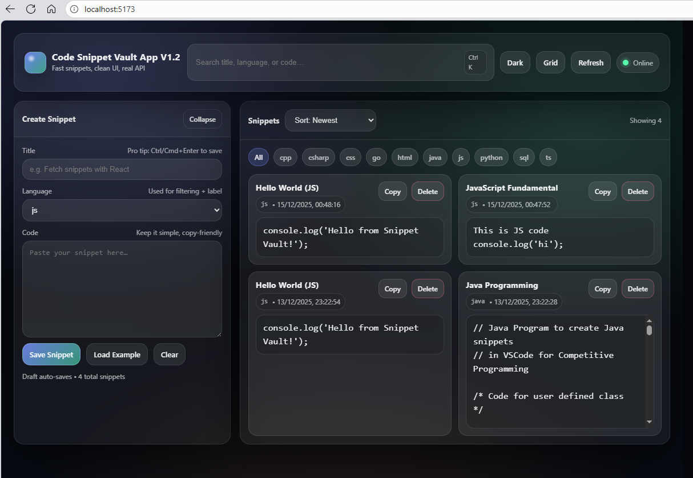
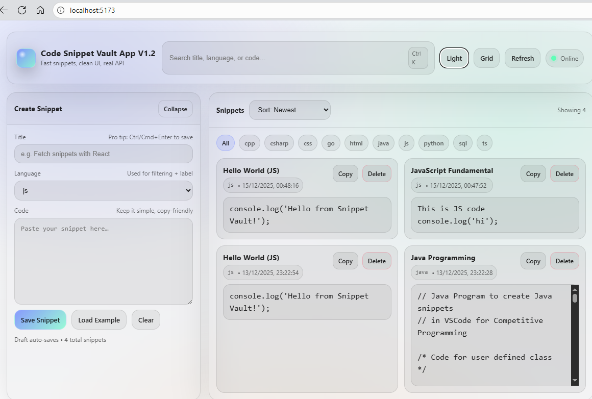

# Code Snippet Vault – MERN Code Snippet Manager


A **powerful, secure, and modern Code Snippet Manager** built with the full **MERN stack**. Perfect for learning full-stack development with real-world authentication and CRUD operations. The authentication and CRUD development entire MERN cycle app tutorial can be found on Canvas LMS course workspace. Here, this is simple working Code Snippet app with two versions to explore.

> **Feel free to explore, learn, and modify!** The code is heavily commented for educational purposes.  
> **Important Note:** This repository contains **two frontend versions** for different learning stages:
> - `client/` → **Complete MERN app** with **user authentication (JWT login/register), protected routes, and full security**
> - `client_old/` → **Simple unauthenticated version** (basic snippet GUI – great for beginners or quick testing)

Both frontends connect to the same backend and demonstrate the complete MERN cycle.

## 🚀 Features

- Secure user registration & login with JWT authentication
- Protected dashboard – only accessible when logged in
- Full CRUD operations for code snippets (Create, Read, Update, Delete)
- Responsive & clean UI powered by Bootstrap
- Secure JWT handling with automatic expiry checks
- Environment-based configuration (no hard-coded secrets)
- Production-ready deployment on Render.com

## 📸 App Screenshots (DARK MODE)



## 📸 App Screenshots (LIGHT MODE)


## 🏗️ Project Structure

```bash
snippet-vault/
├── server/                          # Express + Node.js Backend
│   ├── src/
│   │   ├── config/                  # Database connection
│   │   ├── middleware/              # JWT authentication guard
│   │   ├── models/                  # User & Snippet Mongoose schemas
│   │   ├── routes/                  # Auth & snippets API endpoints
│   │   └── index.js                 # Server entry point
│   └── package.json
│
├── client/                          # Main Frontend (Vite + React + Full Auth)
│   ├── src/
│   │   ├── lib/                     # auth.js & api.js utilities
│   │   ├── components/              # Reusable UI components
│   │   ├── pages/                   # Login, Register, Dashboard
│   │   ├── App.jsx                  # Routing & layout
│   │   └── main.jsx                 # Bootstrap & React entry
│   └── package.json
│
├── client_old/                      # Simple unauthenticated frontend (learning variant)
│   ├── src/
│   └── package.json
│
├── .gitignore
└── README.md


🛠️ Tech Stack

MongoDB – Flexible NoSQL database
Express.js – Robust backend framework
React (Vite) – Lightning-fast modern frontend
Node.js – JavaScript runtime
JWT – Secure token-based authentication
Axios – Elegant API communication
Bootstrap – Responsive and beautiful styling
Render.com – Free & easy deployment platform


📖 How to Run Locally

Clone the repositoryBashgit clone https://github.com/Paresh-Rathod/snippet-vault.git
cd snippet-vault
Start the backendBashcd server
npm install
# Create server/.env with MONGO_URI and JWT_SECRET
npm run dev
Run the main frontend (with auth)Bashcd ../client
npm install
# Create client/.env with VITE_API_URL=http://localhost:5000
npm run devOpen http://localhost:5173 → Register → Login → Start managing snippets!
Or run the simple versionBashcd ../client_old
npm install
npm run dev

Detailed step-by-step build tutorial available on Canvas LMS – built completely from scratch!
🔒 Security Best Practices

.env files are never committed (protected by .gitignore)
JWT tokens stored securely with automatic expiry handling
All sensitive routes protected on both backend (middleware) and frontend (guards)
No hard-coded secrets anywhere

🤝 Contributing
Contributions, bug reports, and feature requests are very welcome!
Feel free to:

Fork the repository
Create a feature branch
Submit a Pull Request

📄 License
This project is licensed under the MIT License – free to use, modify, and distribute.

Built with ❤️ by Paresh Rathod
Star this repo if it helped you learn MERN full-stack development! ⭐